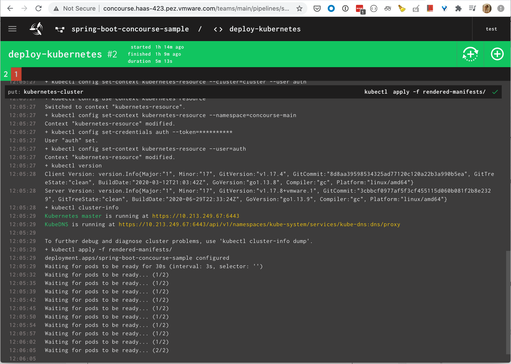

# Provision a Tanzu Kubernetes Cluster

## Connect to the Supervisor Cluster as a vCenter Single Sign-On User

```sh
kubectl vsphere login \
    --server=wcp.haas-423.pez.vmware.com \
    --vsphere-username administrator@vsphere.local \
    --insecure-skip-tls-verify
```

### Check which namespace you are currently in (*)

```sh
kubectl config get-contexts
```

### Switch to the namespace we created

```sh
kubectl config use-context wcp.haas-423.pez.vmware.com
```

### Create a namespace

You have to do this from the Workload Management section in vCenter. Make sure to set the storage class to `pacific-gold-storage-policy`.

### Create the cluster

```sh
kubectl apply -f ./k8s/clusters/basic.yaml
```

### Login

```sh
kubectl vsphere login --server=wcp.haas-423.pez.vmware.com \
    --tanzu-kubernetes-cluster-name tkg-cluster-1 \
    --tanzu-kubernetes-cluster-namespace ns1 \
    --vsphere-username administrator@vsphere.local \
    --insecure-skip-tls-verify
```

### Security

Tanzu Kubernetes Grid Service provisions Tanzu Kubernetes clusters with the [PodSecurityPolicy Admission Controller](https://docs.vmware.com/en/VMware-vSphere/7.0/vmware-vsphere-with-kubernetes/GUID-CD033D1D-BAD2-41C4-A46F-647A560BAEAB.html) enabled. This means that pod security policy is required to deploy workloads.

Tanzu Kubernetes clusters include default `PodSecurityPolicy` that you can bind to for privileged and restricted workload deployment.

For `default` namespace:

```sh
kubectl create rolebinding rolebinding-default-privileged-sa-ns_default \
    --namespace=default --clusterrole=psp:vmware-system-privileged \
    --group=system:serviceaccounts
```

For cluster:

```sh
kubectl create clusterrolebinding clusterrolebinding-privileged-sa \
    --clusterrole=psp:vmware-system-privileged \
    --group=system:serviceaccounts
```

Then you can deploy the [Kubernetes Guestbook application](https://kubernetes.io/docs/tutorials/stateless-application/guestbook/).

### Harbor

To use Harbor as an internal registry, you'll need to configure the docker daemon on every worker to use an insecure registry or update the certs. See `add-harbor-cert-to-docker.sh` to update the certs and reboot the MacOS docker daemon. You can use the same script to update the Kubernetes nodes but you'll have to uncomment out some things first. Or you can login to every node and change the `/etc/docker/daemon.json` file like below:

```yaml
{
    "insecure-registries": ["10.213.249.66"],
    "exec-opts": ["native.cgroupdriver=systemd"],
    "bridge": "none",
    "log-driver": "json-file",
    "log-opts": {
       "max-size": "10m",
       "max-file": "3"
    }
}
```

where `10.213.249.66` is the IP of harbor.

Then run:

```sh
sudo systemctl restart docker
```

### Install Contour for Ingress

 The following steps include the procedure taken from [Tanzu Kubernetes Ingress Example](https://docs.vmware.com/en/VMware-vSphere/7.0/vmware-vsphere-with-tanzu/GUID-68AF0CE7-EA54-4D22-A3E6-0CEC2DF284C2.html?hWord=N4IghgNiBcIJYDsDmAnApgZwyAvkA) to deploy the Contour ingress controller.

1. Deploy Contour with the changes specified in the example

    ```sh
    kubectl apply -f k8s/contour/contour.yaml
    ```

    __NOTE__: If you're running [multiple ingress controllers](https://projectcontour.io/docs/main/deploy-options/), or running on a cloud provider that natively handles ingress, you can specify the annotation `kubernetes.io/ingress.class: "contour"` on all ingresses that you would like Contour to claim. You can customize the class name with the `--ingress-class-name` flag at runtime. If the `kubernetes.io/ingress.class` annotation is present with a value other than `"contour"`, Contour will ignore that ingress.

    __NB__: If you're not getting an `EXTERNAL-IP` address then you need to check the `kube-controller-manager` logs. Some indication of what's happening should appear in the those logs. Contour doesn't provision Load Balancers. Envoy doesn't care how the traffic gets to it as long as it happens. So you may have to check with the cloud provider to see how it's supposed to be configured.

    In this deployment, Contour created the [certs](https://projectcontour.io/docs/v1.9.0/grpc-tls-howto/#manual-tls-certificate-generation-process) for communication over gRPC between Envoy and Contour using the `contour-certgen` job. To create the certs manually, follow these [instructions](https://projectcontour.io/docs/v1.9.0/grpc-tls-howto/#manual-tls-certificate-generation-process).

#### Contour Examples

1. Deploy Ingress example

    ```sh
    kubectl apply -f k8s/contour/ingress-test.yaml
    ```

1. Test Ingress example

    ```sh
    export LOAD_BALANCER_IP=$(kubectl -n projectcontour get service envoy -o jsonpath='{.status.loadBalancer.ingress[0].ip}')
    curl http://$LOAD_BALANCER_IP:80/hello
    {"message":"Hello"}
    curl http://$LOAD_BALANCER_IP:80/nihao
    {"message":"Hello"}
    ```

    The VMware docs have you deploy an example that uses the standard Kubernetes Ingress object, however, Contour has expanded functionality of the Ingress object using the HTTPProxy CRD. To read more about this, see their documentation [here](https://projectcontour.io/docs/main/httpproxy/).

1. Deploy HTTPProxy example

    ```sh
    kubectl apply -f k8s/contour/httpproxy-test.yaml
    ```

1. Test HTTPProxy example

    ```sh
    export LOAD_BALANCER_IP=$(kubectl -n projectcontour get service envoy -o jsonpath='{.status.loadBalancer.ingress[0].ip}')
    curl -H "Host: hello.local" http://$LOAD_BALANCER_IP:80/hello
    {"message":"Hello"}
    curl -H "Host: hello.local" http://$LOAD_BALANCER_IP:80/nihao
    {"message":"Hello"}
    ```

1. Deploy HTTPProxy example with TLS

    * Create a namespace for tls delegation

        ```sh
        kubectl create ns www-admin
        ```

    * Install [Cert Manager](https://cert-manager.io/docs/installation/kubernetes/#installing-with-regular-manifests)

        ```sh
        kubectl apply --validate=false -f https://github.com/jetstack/cert-manager/releases/download/v1.0.2/cert-manager.yaml
        ```

    * Verify the Installation

        ```sh
        kubectl get pods --namespace cert-manager
        ```

    * Deploy the app

        ```sh
        kubectl apply -f k8s/contour/httpproxy-test-tls.yaml
        ```

    * Test

        ```sh
        curl -k https://hello.haas-423.pez.vmware.com/hello
        {"message":"Hello"}
        curl -k https://hello.haas-423.pez.vmware.com/nihao
        {"message":"Hello"}
        ```

## CI/CD

Installing the Concourse Helm chart using the documentation [here](https://docs.pivotal.io/p-concourse/v6/).

There are some helper scripts to assist in adding the harbor root ca to your local docker daemon as well as the one used by the nodes in a Kubernetes cluster.

1. Deploy the Concourse Helm chart.

```
cd concourse-helm
./install.sh
```

Once Concourse is deployed, you can use this [example](https://cnr.eng.vmware.com/ci-cd/guides/building-and-deploying-with-concourse-ci/) to deploy the [spring-boot-sample](https://github.com/alexbrand/spring-boot-concourse-sample) app to it.

I created a [fork](https://github.com/malston/spring-boot-concourse-sample) of it so I could add a [service account](https://github.com/malston/spring-boot-concourse-sample/blob/master/ci/concourse-service-account.yaml) for Concourse to deploy the app to a specific [namespace](https://github.com/malston/spring-boot-concourse-sample/commit/bd920731f21321e12044a400e52ac675a3a35be0).



The [kubernetes](https://github.com/zlabjp/kubernetes-resource) Concourse resource is no longer maintained, but you could easily [accomplish the same thing](https://github.com/zlabjp/kubernetes-resource/blob/master/assets/out) with a custom task.

### Flux
